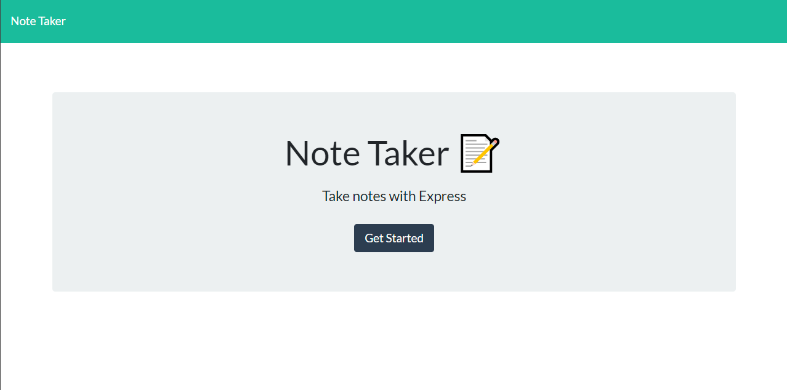
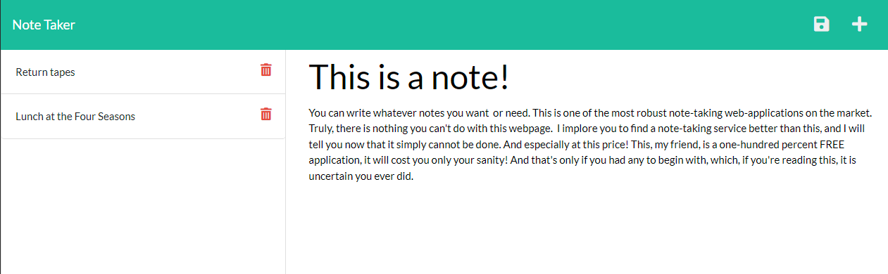

# Note Taker

	
## Description

Note taker is a web application designed to save notes for a user to refer back to later. It utilizes node JS with express.

## Table of Contents

- [Installation](#installation)
- [Usage](#usage)
- [Contributing](#contributing)
- [Tests](#tests)
- [Questions](#questions)

## Installation

No installation is needed, the application is deployed [here](https://cmseibel-note-taker.herokuapp.com/).

## Usage

To use, simply type a title for your note in the first text field, and then you may go wild typing the body of the note in the next text field.

## Contributing

Do what you will with it, be excellent dudes.

## Tests

There are no tests involved with this project. To test, simply use it and tell me when it breaks.

## Questions

I can be found on GitHub [here](https://github.com/CameronMSeibel).
If you have any questions, I can be reached at cam.m.seib@gmail.com

